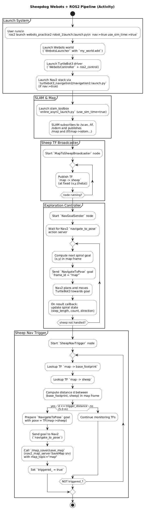
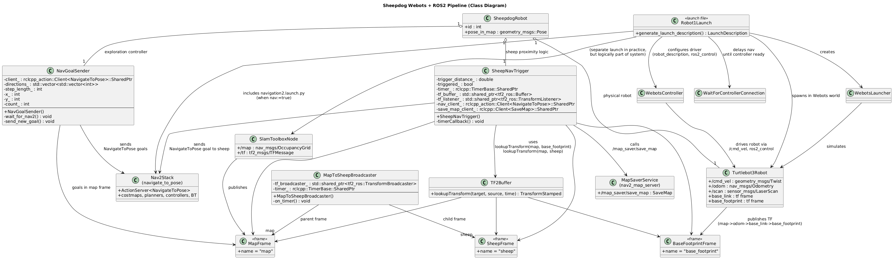
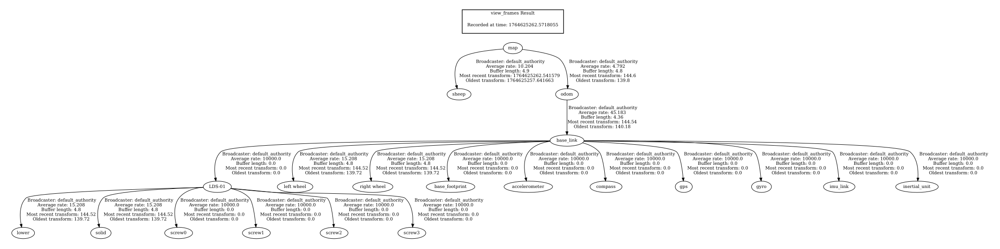

# Final Project Phase 1
[](https://github.com/dzinobile/ENPM700_TDD_group1/actions/workflows/run-unit-test-and-upload-codecov.yml)

[](https://codecov.io/gh/dzinobile/ENPM700_Final_Group1)

## Links
### AIP Tracker
https://docs.google.com/spreadsheets/d/12TAMyx9cW5lwyse37VmfeIvLcLHgc6YgxtjMCqo1hIw/edit?usp=sharing

# Objectives
Our objective for phase 1 was originally to create proof of concept simulations in Webots demonstrating multi-robot SLAM and the ability to encircle a target, using the turtlebot3 with its built in navigation stack. We would then create the general structure of our final package and beginning filling in the functionality. 

However, we experienced difficulties with launching a full navigation stack for each separate turtlebot. We have adjusted the scope of this phase to instead focus on creating a functional SLAM search with 1 turtlebot3 in a custom environment, with the hope that this will be applicable to a multi-robot simulation in phase 2. 

# Sheepdog – Webots + ROS 2 Navigation (Phase 1)

Single-robot “sheepdog” prototype: a TurtleBot3 Burger in Webots explores a world with Nav2, tracks a virtual sheep frame using TF2, and when the robot is close enough, it sends a navigation goal directly to the sheep and saves the current map. This phase is structured as a foundation for a future multi-robot herding swarm.

---
## Contents

- [Overview](#overview)
- [Architecture & Pipeline](#architecture--pipeline)
  - [Core Nodes](#core-nodes)
  - [Execution Pipeline](#execution-pipeline)
- [UML & TF2 Diagrams (placeholders)](#uml--tf2-diagrams-placeholders)
- [ROS 2 Interfaces](#ros-2-interfaces)
  - [TF2 Frame Tree](#tf2-frame-tree)
  - [Topics](#topics)
  - [Actions](#actions)
  - [Services](#services)
- [Package Layout](#package-layout)
- [Dependencies](#dependencies)
- [Building](#building)
- [Running the System](#running-the-system)
  - [1. Launch Webots, TurtleBot3, and Nav2](#1-launch-webots-turtlebot3-and-nav2)
  - [2. Sheep TF publisher](#2-sheep-tf-publisher)
  - [3. Spiral exploration](#3-spiral-exploration)
  - [4. Sheep proximity trigger + map saving](#4-sheep-proximity-trigger--map-saving)
- [Testing](#testing)
- [Documentation](#documentation)
- [Future Extensions](#future-extensions)
- [License](#license)

----

## Overview

The `sheepdog` package provides:

- A **Webots world** (`my_world.wbt`) with a TurtleBot3 Burger.
- A **launch file** that brings up:
  - Webots + `webots_ros2_driver`.
  - TurtleBot3 controllers (`diff_drive_controller`, `joint_state_broadcaster`).
  - `robot_state_publisher` and a static TF between `base_link` and `base_footprint`.
  - The Nav2 navigation stack via `turtlebot3_navigation2` when configured.
- Three custom ROS 2 nodes:
  - `sheep_broadcaster`: publishes a TF transform from `map` to `sheep`.
  - `nav_goal_sender`: sends a spiral sequence of `NavigateToPose` goals.
  - `sheep_nav_trigger`: monitors TF distance to the sheep, sends a Nav2 goal to the sheep, and saves a snapshot of the map.
- An integration test using `catch_ros2` that sends a Nav2 goal and checks for success.
- A small documentation helper script (`do-docs.bash`) to build package docs via a `docs` CMake target.

---

## Architecture & Pipeline

### Core Nodes

**1. Launch system (`sheepdog.launch.py`)**

- Package: `sheepdog`
- Responsibilities:
  - Launch Webots in realtime mode with `my_world.wbt`.
  - Start the TurtleBot3 driver via `WebotsController`.
  - Spawn:
    - `diffdrive_controller`
    - `joint_state_broadcaster`
    - `robot_state_publisher`
    - `static_transform_publisher` for `base_link → base_footprint`.
  - Optionally launch the Nav2 stack from `turtlebot3_navigation2` using a static map (`my_world.yaml`).

**2. Sheep TF broadcaster (`sheep_broadcaster`)**

- Source: `src/sheepdog/src/sheep_broadcaster.cpp`
- Node name: `sheep_broadcaster`
- Uses: `tf2_ros::TransformBroadcaster`
- Publishes at 10 Hz:
  - Parent frame: `map`
  - Child frame: `sheep`
  - Pose: currently hard-coded (e.g., `(4.0, 4.0, 0.0)` with a fixed yaw).

**3. Spiral exploration controller (`nav_goal_sender`)**

- Source: `src/sheepdog/src/nav_goal_sender.cpp`
- Node name: `nav_goal_sender`
- Uses: `rclcpp_action::Client<nav2_msgs::action::NavigateToPose>`
- Responsibilities:
  - Wait for `/navigate_to_pose` action server (Nav2).
  - Maintain an integer grid position `(x_, y_)` in the map frame.
  - Move in directions `[+x, +y, -x, -y]` with an increasing `step_length_` to trace an outward spiral.
  - After each result (success or failure), send the next goal, ensuring continuous exploration.

**4. Sheep proximity trigger + map saver (`sheep_nav_trigger`)**

- Source: `src/sheepdog/src/sheep_nav_trigger.cpp`
- Node name: `sheep_nav_trigger`
- Uses:
  - `tf2_ros::Buffer` + `tf2_ros::TransformListener`
  - `rclcpp_action::Client<nav2_msgs::action::NavigateToPose>`
  - `rclcpp::Client<nav2_msgs::srv::SaveMap>`
- Responsibilities (periodic timer):
  1. Lookup TF transforms:
     - `map → base_footprint`
     - `map → sheep`
  2. Compute planar distance between `base_footprint` and `sheep` in the map frame.
  3. If distance ≤ `trigger_distance_` (currently 2.0 m):
     - Send a Nav2 `NavigateToPose` goal exactly at the `sheep` pose.
     - Call `/map_saver/save_map` to persist the current map (`sheep_snapshot_map`).
     - Set `triggered_` to `true` so the trigger fires only once.

### Execution Pipeline

End-to-end behavior:

1. **Simulation and Nav2 bring-up**
   - `sheepdog.launch.py` starts Webots and the TurtleBot3 Burger.
   - Controllers and TFs are configured.
   - Nav2 stack comes up using the static map (`my_world.yaml`) aligned with the Webots world.

2. **Sheep pose publishing**
   - `sheep_broadcaster` publishes a TF `map → sheep`, representing the known sheep pose.
   - This TF is available to any node performing planning or trigger logic.

3. **Exploration**
   - `nav_goal_sender` waits for `/navigate_to_pose`.
   - Once active, it sends a sequence of map-frame goals in a grid spiral.
   - Nav2 plans and executes each goal, causing the robot to explore the map.

4. **Sheep detection and reaction**
   - `sheep_nav_trigger` periodically consults TF between `base_footprint` and `sheep`.
   - When the robot reaches the trigger radius around the sheep:
     - A final Nav2 goal is set to the exact sheep TF pose.
     - A map snapshot is saved using the `SaveMap` service.

This structure is deliberately generic so that additional robots (multi-robot “dogs”) and more complex sheep motion models can be added in later phases.

---

## UML & TF2 Diagrams

- Activity diagram (pipeline overview):
  


- Class diagram (nodes and their relationships):
    

- TF2 frame tree diagram:
  

---

## ROS 2 Interfaces

### TF2 Frame Tree

Conceptual frame tree:

```text
map
├── sheep
└── odom              (Nav2 / robot state)
    └── base_link
        └── base_footprint
        └── ... (other sensor frames as needed)
````

* `map → sheep` is provided by `sheep_broadcaster`.
* `map → odom`, `odom → base_link`, etc., are provided by the Nav2 / robot stack and Webots driver.
* `base_link → base_footprint` is provided by a static transform publisher in the launch file.

### Topics

Key topics used in this project:

| Topic        | Type                         | Producer / Consumer                     | Notes                   |
| ------------ | ---------------------------- | --------------------------------------- | ----------------------- |
| `/cmd_vel`   | `geometry_msgs/msg/Twist`    | Nav2 controller → Webots driver         | Robot velocity commands |
| `/odom`      | `nav_msgs/msg/Odometry`      | Webots driver / diffdrive controller    | Robot odometry          |
| `/scan`      | `sensor_msgs/msg/LaserScan`  | Webots TurtleBot3 sensors               | Used by Nav2 / SLAM     |
| `/map`       | `nav_msgs/msg/OccupancyGrid` | Map server / SLAM                       | Global 2D map           |
| `/tf`        | `tf2_msgs/msg/TFMessage`     | Multiple nodes                          | Dynamic transforms      |
| `/tf_static` | `tf2_msgs/msg/TFMessage`     | Static publishers (`map → sheep`, etc.) | Static transforms       |

### Actions

* `/navigate_to_pose` – `nav2_msgs/action/NavigateToPose`

  * **Clients**:

    * `nav_goal_sender`
    * `sheep_nav_trigger`
  * **Server**:

    * Nav2 (e.g. `bt_navigator`).

Each client constructs goals in the `map` frame, with positions chosen either by the spiral logic or directly from the TF `map → sheep`.

### Services

* `/map_saver/save_map` – `nav2_msgs/srv/SaveMap`

  * **Client**: `sheep_nav_trigger`
  * **Server**: `nav2_map_server` (part of Nav2 stack)
  * Used to persist the current map to a file (`sheep_snapshot_map` with format `pgm` and YAML metadata).

---

## Package Layout

Within the workspace, the `sheepdog` package is organized as:

```text
ENPM700_Final_Group1/
├── LICENSE
├── do-docs.bash
├── do-tests-and-coverage.bash
├── README.md             
└── src/
    └── sheepdog/
        ├── CMakeLists.txt
        ├── package.xml
        ├── launch/
        │   └── sheepdog.launch.py
        ├── worlds/
        │   └── my_world.wbt
        ├── resource/
        │   ├── my_world.yaml
        │   └── my_world.pgm
        ├── src/
        │   ├── nav_goal_sender.cpp
        │   ├── sheep_broadcaster.cpp
        │   └── sheep_nav_trigger.cpp
        └── test/
            └── integration_test_node.cpp
```

---

## Dependencies

### ROS 2 and OS

* ROS 2 Humble (or later) on Ubuntu.
* Webots installed and accessible (e.g., via `ros-${ROS_DISTRO}-webots-ros2`).

### Package dependencies (from `CMakeLists.txt` and `package.xml`)

Build-time and runtime:

* `ament_cmake`
* `rclcpp`
* `rclcpp_action`
* `nav2_msgs`
* `nav_msgs`
* `geometry_msgs`
* `tf2`
* `tf2_ros`
* `tf2_geometry_msgs`
* `webots_ros2_driver`
* `webots_ros2_msgs`
* `robot_state_publisher`
* `controller_manager`
* `diff_drive_controller`
* `joint_state_broadcaster`
* `pluginlib`
* `launch`
* `launch_ros`
* `catch_ros2` (for integration testing)

On Ubuntu with ROS 2 Humble, a typical install set (to be adapted as needed) is:

```bash
sudo apt update
sudo apt install \
  ros-humble-webots-ros2 \
  ros-humble-webots-ros2-turtlebot \
  ros-humble-turtlebot3-navigation2 \
  ros-humble-navigation2 \
  ros-humble-nav2-map-server \
  ros-humble-slam-toolbox \
  ros-humble-catch-ros2
```

---

## Building

Create a workspace and build the package:

```bash
# Create workspace
mkdir -p ~/sheepdog_ws/src
cd ~/sheepdog_ws/src

# Option 1: copy/extract the ENPM700_Final_Group1 folder here
# Option 2: clone from git (if remote is configured)
# git clone https://github.com/dzinobile/ENPM700_Final_Group1.git

cd ..
colcon build --packages-select sheepdog
source install/setup.bash
```

---

## Running the System

### 1. Launch Webots, TurtleBot3, and Nav2

In a first terminal:

```bash
cd ~/sheepdog_ws
source install/setup.bash

ros2 launch sheepdog sheepdog.launch.py \
  world:=my_world.wbt \
  nav:=true \
  use_sim_time:=true
```

This launch file:

* Starts Webots with `my_world.wbt`.
* Spawns the TurtleBot3 Burger.
* Brings up the robot drivers, TFs, and controllers.
* Launches Nav2 configured to use `resource/my_world.yaml`.

### 2. Sheep TF publisher

In a second terminal:

```bash
cd ~/sheepdog_ws
source install/setup.bash

ros2 run sheepdog sheep_broadcaster
```

This node continuously publishes `map → sheep` TF.

### 3. Spiral exploration

In a third terminal:

```bash
cd ~/sheepdog_ws
source install/setup.bash

ros2 run sheepdog nav_goal_sender
```

The robot begins to receive a sequence of `NavigateToPose` goals and explores the map in a growing spiral centered at the origin of the map frame.

### 4. Sheep proximity trigger + map saving

In a fourth terminal:

```bash
cd ~/sheepdog_ws
source install/setup.bash

ros2 run sheepdog sheep_nav_trigger
```

Behavior:

* Periodically looks up `map → base_footprint` and `map → sheep`.
* Computes the planar distance; once it is less than or equal to `trigger_distance_` (2 m):

  * Sends a `NavigateToPose` goal exactly at the sheep TF pose.
  * Calls `/map_saver/save_map` with configured parameters, saving a map called `sheep_snapshot_map`.
* Afterwards, `triggered_` is set to `true` so the trigger is one-shot.

---

## Testing

Integration testing is wired with `catch_ros2`:

* Test source: `src/sheepdog/test/integration_test_node.cpp`
* CMake:

  * `find_package(catch_ros2 REQUIRED)`
  * `catch_ros2_add_integration_test(ExampleIntegration_TestYAML ...)`
* Test behavior (as implemented in the node):

  * Creates a fixture with an action client to `/navigate_to_pose`.
  * Waits for the Nav2 action server to become available.
  * Sends a simple `NavigateToPose` goal in the map frame.
  * Waits for the action result within a defined timeout.
  * Asserts that the result code is `rclcpp_action::ResultCode::SUCCEEDED`.

To build and run tests locally:

```bash
cd ~/sheepdog_ws
colcon build --cmake-args -DBUILD_TESTING=ON --packages-select sheepdog
source install/setup.bash

colcon test --packages-select sheepdog
colcon test-result --verbose
```

Note: the integration test expects a running Nav2 stack and appropriate simulation or map server configuration. A launch file named `integration_test.launch.yaml` is referenced in CMake as an example and can be configured to start the full stack automatically during CI.


---

## Future Extensions

The current design is intended as Phase 1 of a larger project:

* **Multi-robot extension:**
  Multiple TurtleBot3 “sheepdogs,” each with its own namespace, `nav_goal_sender`, and `sheep_nav_trigger`.
* **Dynamic sheep models:**
  Replace static TF broadcasting with a simulated moving sheep in Webots, with pose updates broadcast from a Webots controller.
* **Herding strategies:**
  Use behavior trees or explicit finite-state machines for herding, surrounding, and guiding the sheep toward target regions.
* **Richer testing:**
  Add more integration tests combining SLAM, multi-robot coordination, and robustness to sensing or TF delays.

---

## License

This project is licensed under the **Apache License 2.0**.

See the `LICENSE` file for full terms.

```
::contentReference[oaicite:0]{index=0}
```

ros2 launch slam_toolbox online_async_launch.py use_sim_time:=true